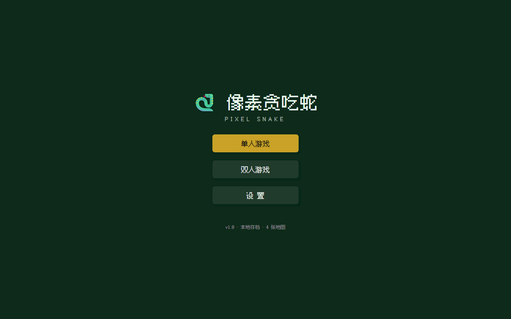
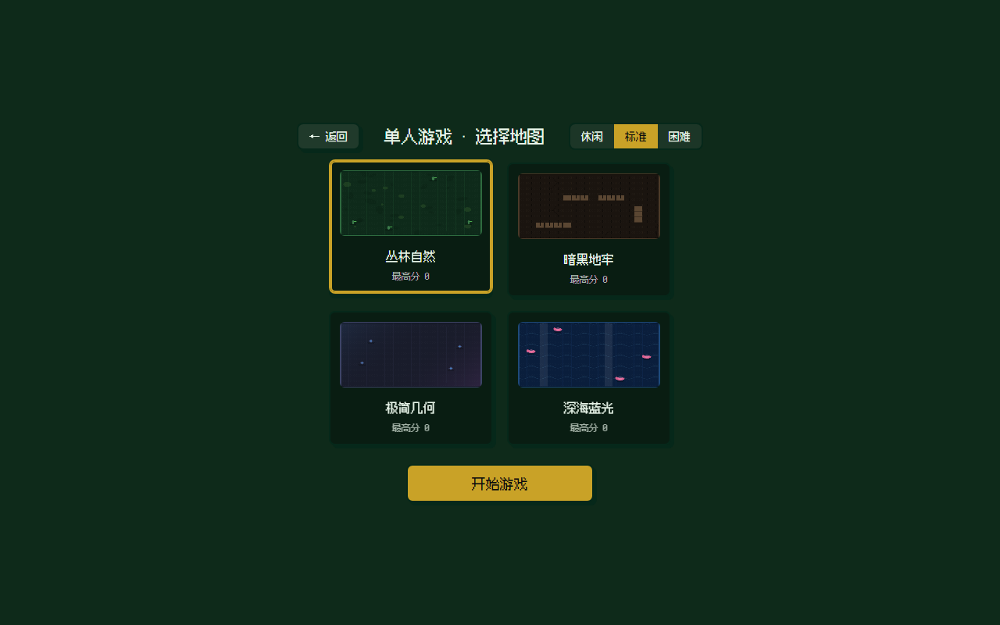
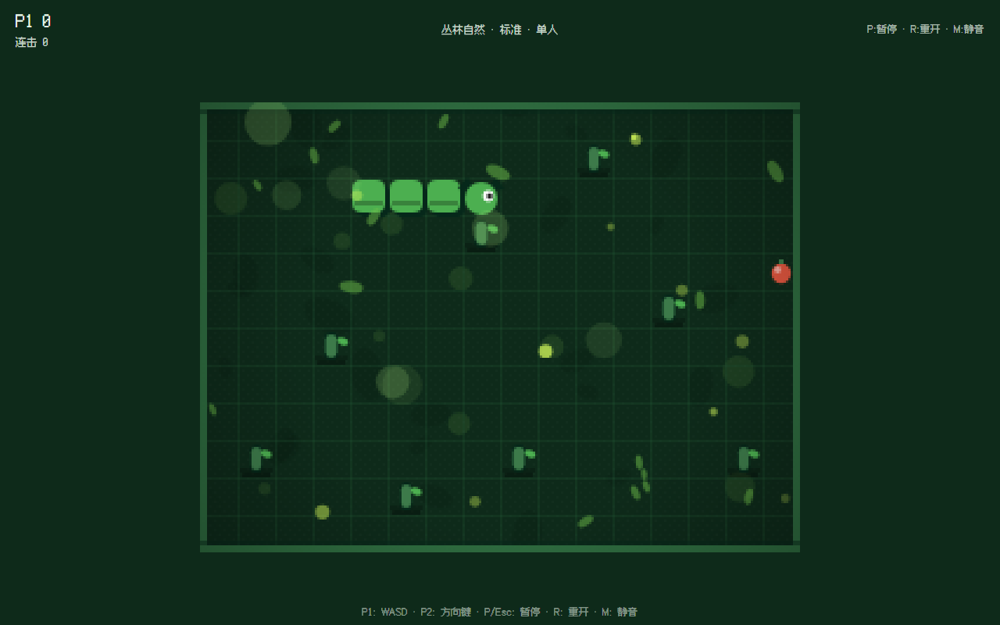
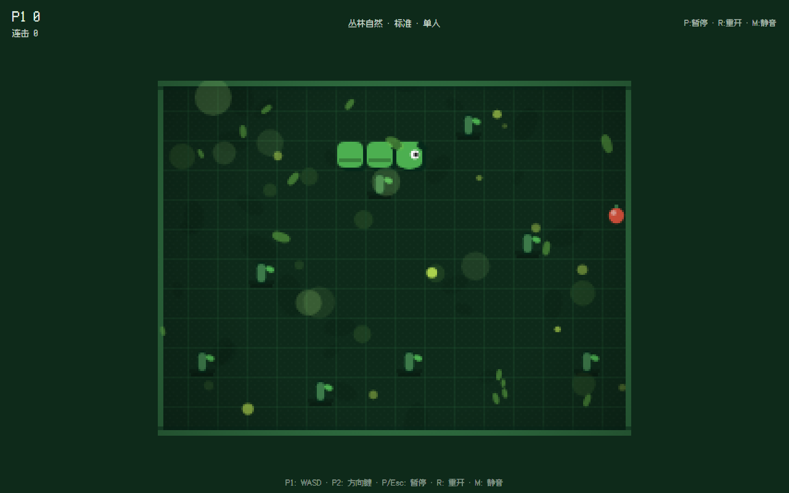
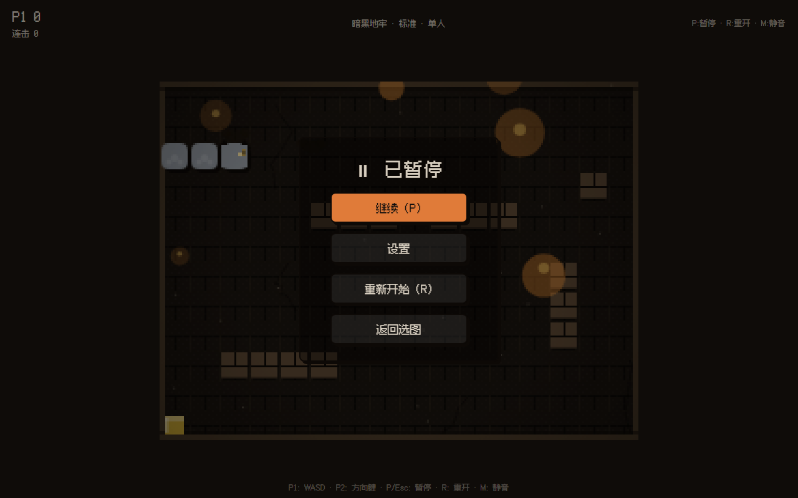
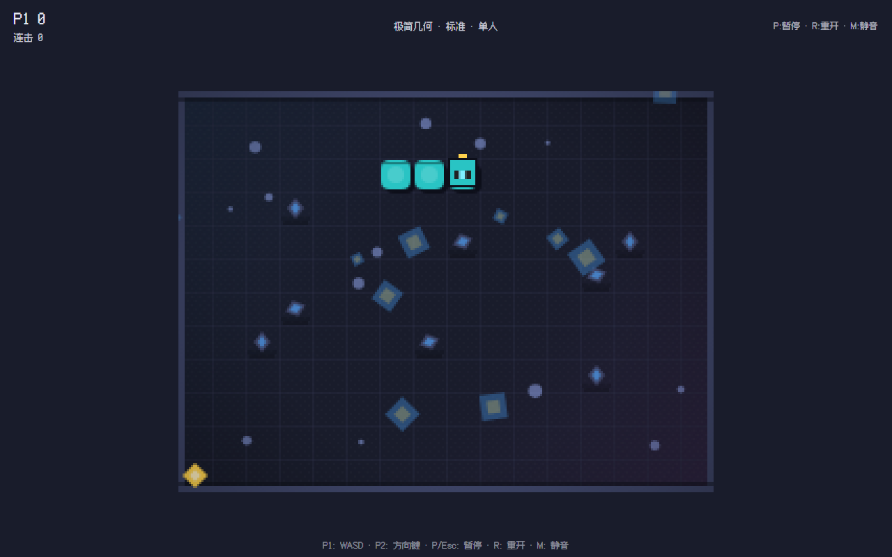
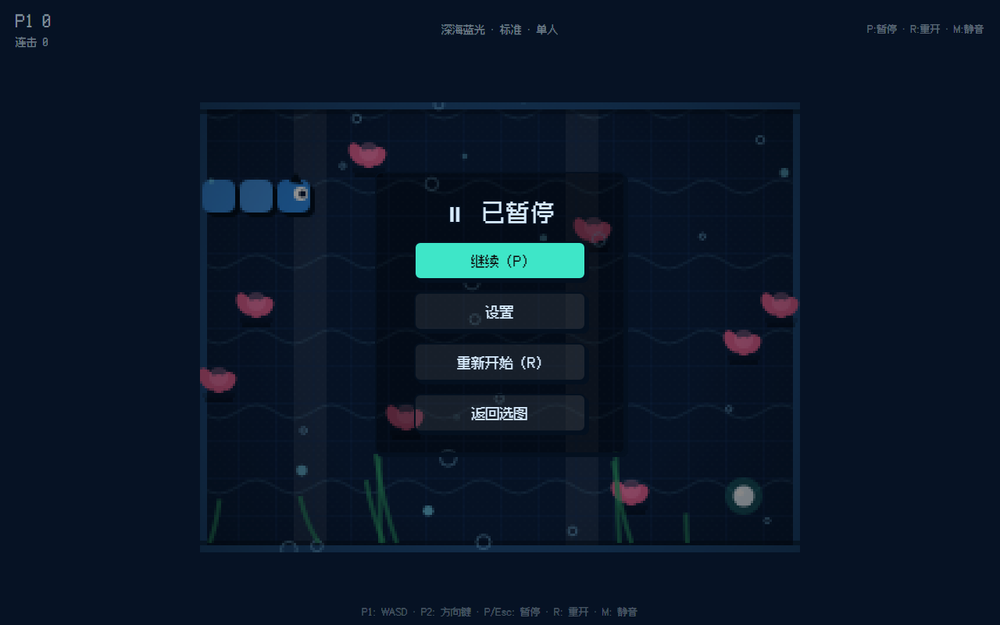

# 🐍 像素贪吃蛇（Pixel Snake）

卡通像素风格的贪吃蛇小游戏：画面丰富、色彩丰富、动效流畅，支持多地图切换与双人合作模式。

> **当前状态**：开发中 🔧 —— 设计文档全齐（docs/00~10），工程已可运行：逻辑层 39 单测全绿、构建通过、dev server 可在浏览器试玩（`npm run dev`）。

## 文档索引

| 文档 | 内容 |
|---|---|
| [docs/00-项目概览.md](docs/00-项目概览.md) | 项目定位、技术栈、核心原则、决策记录 |
| [docs/01-设计定案.md](docs/01-设计定案.md) | 全部决策的汇总（单一事实来源） |
| [docs/02-视觉风格与主题规格.md](docs/02-视觉风格与主题规格.md) | 卡通像素风格体系、四张地图/主题规格 |
| [docs/03-玩法与规则.md](docs/03-玩法与规则.md) | 模式、计分、难度、双人、操控、状态机 |
| [docs/04-架构设计.md](docs/04-架构设计.md) | 分层架构、目录结构、数据流、接口草案 |
| [docs/05-体验保障与性能.md](docs/05-体验保障与性能.md) | 流畅性、布局、加载动画、报错兜底、性能降级 |
| [docs/06-开发计划与工具链.md](docs/06-开发计划与工具链.md) | 调试面板、数据校验、单元测试、实施顺序、后置项 |
| [docs/07-界面布局线框.md](docs/07-界面布局线框.md) | 三层导航布局线框（Minecraft 式） |
| [docs/08-协作开发规范.md](docs/08-协作开发规范.md) | AI 协作流程、Git 工作流、校验流水线、已知坑清单 |
| [docs/09-地图风格细节定案.md](docs/09-地图风格细节定案.md) | 四张地图全部视觉/听觉/布局细节量化定案（唯一标准） |

## 运行截图（真实浏览器渲染）

| 主菜单 | 选图界面 | 游戏画面 |
|---|---|---|
|  |  |  |

| 丛林自然 | 暗黑地牢 | 极简几何 | 深海蓝光 |
|---|---|---|---|
|  |  |  |  |

> 截图由 `npm run e2e` 无头浏览器自动生成，可随时重新生成。

## 一句话定位

> **逻辑纯 TS、渲染纯 Canvas、地图和主题都是数据文件、React 只管界面、localStorage 管存档**——五层解耦，每层文件都小，改地图不改逻辑，改特效不改规则。

## 核心决策速览

- 技术栈：TypeScript + Vite + React + Zustand + Canvas 2D + localStorage
- 风格：卡通像素（粗描边 / 圆角 / 硬阴影 / 有限调色板 / Fusion Pixel 中文字体）
- 地图：丛林自然 · 暗黑地牢 · 极简几何 · 深海蓝光（动态障碍，UI 跟随主题换肤）
- 玩法：经典单人无尽 + 双人合作（各自计分，10 秒复活机制）
- 体验：固定步长插值、离屏预渲染、资源清单加载、五层报错兜底、三级画质自动降级
